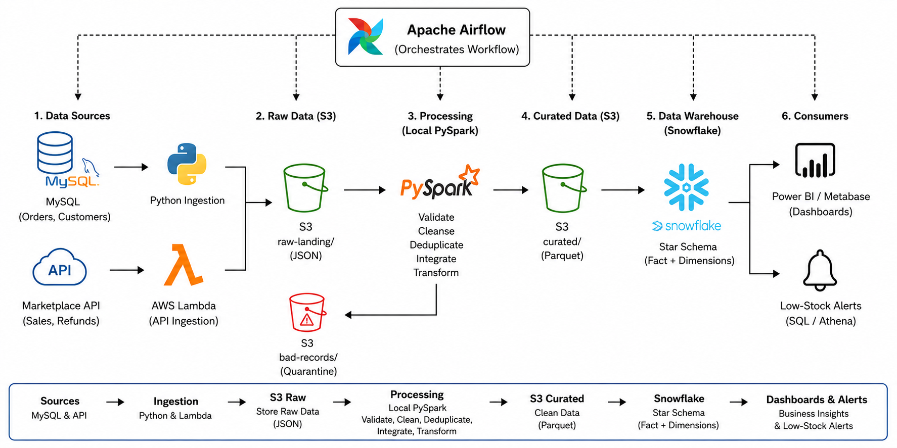
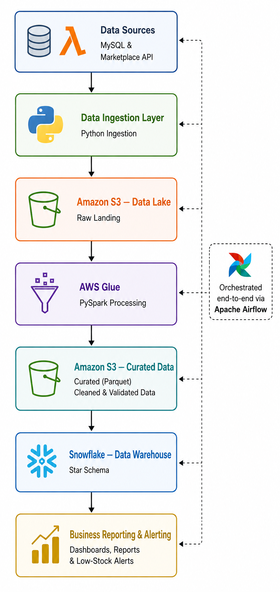

# E-Commerce Multi-Channel Revenue & Inventory Intelligence System

This project is designed as a realistic end-to-end Data Engineering solution for monitoring revenue, inventory, and sales performance across multiple sales channels. The system integrates data from internal and external sources, processes and validates it using **AWS Glue Jobs written in PySpark**, stores raw and curated data in Amazon S3, loads business-ready datasets into Snowflake using a star schema design, and provides business insights through SQL queries against Snowflake.

---

## 1. System Architecture



### Architecture Flow



---

## 2. Key Improvements Over the Initial Design

### A. Realistic Data Sources
Instead of simulating multiple e-commerce platforms using static generated JSON files, the architecture uses two practical and industry-relevant source types:
- **MySQL Database**: Represents the organization's internal e-commerce platform. Stores operational data such as orders and customer information.
- **Marketplace API**: Simulates external marketplaces such as Amazon and Flipkart. Provides sales and refund data in JSON format through a REST API. The API data is generated and served using **AWS Lambda**.

*Benefit:* This reflects a real-world integration pattern commonly used in Data Engineering projects and is more credible during technical interviews.

### B. AWS Glue (PySpark) Data Processing
Data transformation is performed using **AWS Glue Jobs written in PySpark**. Key responsibilities include:
- Data cleansing
- Schema validation
- Deduplication
- Data standardization
- Multi-source data integration

AWS Glue provides a managed Apache Spark environment, while PySpark is used to implement the transformation logic.

*Benefit:* Demonstrates knowledge of both AWS Glue as a managed ETL service and PySpark as the underlying distributed processing framework.

### C. Data Quality and Quarantine Handling
The architecture includes a dedicated quarantine layer for invalid records. Valid records proceed through the pipeline, while invalid or malformed records are routed and stored in the quarantine zone:
`s3://e-commerce-multi-channel/bad-records/`

Examples of quarantined records:
- Missing mandatory fields
- Invalid data types
- Corrupted JSON payloads
- Schema mismatches

*Benefit:* Prevents downstream pipeline failures and follows production-grade data quality practices.

### D. Star Schema Data Warehouse Design
Instead of loading all information into a single denormalized table, the warehouse follows a dimensional modeling approach.

#### Fact Table: `fact_sales`
Contains:
- Quantity sold
- Sales amount
- Refund amount
- Transaction date
- Product key
- Customer key
- Channel key

#### Dimension Tables:
- `dim_products`: Product ID, Product Name, Category, Price
- `dim_customers`: Customer ID, Customer Details (First Name, Last Name, Email, Phone)
- `dim_channels`: Sales Channel, Website, Marketplace

*Benefit:* Improves analytical performance and demonstrates strong data warehousing knowledge.

### E. Local Development Environment
The project uses **Docker Compose** to run services locally.
Components:
- Apache Airflow (Official Airflow Docker Compose configuration, with project-specific volume mounts and dependencies configured).
- MySQL (Transactional operational database).

*Benefit:* Enables development and testing without maintaining cloud infrastructure continuously.

### F. Serverless API Data Generation (AWS Lambda + Amazon API Gateway)
The Marketplace API source is exposed using **Amazon API Gateway** and generated/served dynamically using **AWS Lambda**. Since the Marketplace source is an external API and does not require heavy processing, this combination acts as a lightweight serverless component to generate realistic marketplace sales and refund data in JSON format.

*Lambda & API Gateway Responsibilities:*
- **Amazon API Gateway**: Exposes public HTTPS endpoints (`/sales` and `/refunds`) and routes incoming HTTP requests to our Lambda function.
- **AWS Lambda**: Programmatically generates mock sales/refund transaction lists on-demand and returns JSON payloads.

---

## 3. Architecture Components in Detail

### Data Ingestion Layer
- **MySQL Extraction**: Python-based ingestion jobs connect to the local database using `pymysql`, extract incremental order and customer data, convert extracted records into local staging files, upload them to `s3://e-commerce-multi-channel/raw-landing/mysql/` and clean up staging files.
- **Marketplace API Extraction**: The ingestion process calls the public HTTPS endpoints exposed by **Amazon API Gateway**, which triggers the underlying **AWS Lambda** function. It performs basic response validation, generates raw JSON files, uploads them to `s3://e-commerce-multi-channel/raw-landing/marketplace/` and cleans up staging files.

### Data Lake Storage Layer (S3 Bucket: `e-commerce-multi-channel`)
- **Raw Landing Zone (`raw-landing/`)**: Stores original source data, historical snapshots, audit copies, and unmodified source records.
- **Quarantine Zone (`bad-records/`)**: Stores invalid records and failed validations to allow troubleshooting without impacting downstream processing.
- **Curated Zone (`curated/`)**: Stores cleansed, deduplicated, and standardized Parquet datasets generated by the AWS Glue job. Sales data is partitioned by year, month, and day for optimized querying.

### Processing Layer (AWS Glue PySpark Job)
AWS Glue PySpark ETL reads raw data from S3, cleans it, standardizes schema types, resolves sales and refund associations, routes invalid records to quarantine, and outputs parquet formats to `curated/`. 

*Why Glue instead of Lambda for transformations?*
- **AWS Lambda**: Generates and serves API data, handling lightweight single API requests.
- **AWS Glue**: Reads massive raw datasets from S3, performs heavy distributed Spark calculations, joins multiple large tables, and writes optimized Parquet data.

---

## 4. Star Schema DW Modeling (Snowflake)

### Fact Table: `fact_sales`
| Column | Data Type | Description |
| :--- | :--- | :--- |
| **sale_id** | VARCHAR(100) | Unique transaction identifier (Primary Key) |
| **product_key** | INT | Foreign Key reference to `dim_products` |
| **customer_key** | INT | Foreign Key reference to `dim_customers` |
| **channel_key** | INT | Foreign Key reference to `dim_channels` |
| **quantity_sold** | INT | Units sold |
| **sales_amount** | DECIMAL(10,2) | Revenue generated |
| **refund_amount** | DECIMAL(10,2) | Refund value |
| **transaction_date** | TIMESTAMP | Transaction timestamp |

### Dimension Tables
- **`dim_products`**: `product_key` (Identity PK), `product_id` (natural ID), `product_name`, `category`, `price`, `source_system`.
- **`dim_customers`**: `customer_key` (Identity PK), `customer_id` (natural ID), `first_name`, `last_name`, `email`, `phone`, `source_system`.
- **`dim_channels`**: `channel_key` (Identity PK), `channel_name` (Website, Amazon, Flipkart), `channel_type` (Internal, Marketplace).

---

## 5. Directory Structure & Files

```text
airflow/
├── dags/
│   └── ecommerce_pipeline_dag.py  # Orchestrates ingestion, Glue, and Snowflake load
└── logs/
src/
├── ingestion/
│   ├── mysql_ingest.py            # MySQL database extraction script
│   └── marketplace_ingest.py      # Marketplace API extraction script
├── glue/
│   └── ecommerce_glue_transform.py # Simplified Glue PySpark ETL transform script
└── database/
    ├── mysql_schema.sql           # MySQL database schema definition
    ├── mysql_seed.sql             # Seeding operational records
    └── snowflake_schema.sql       # Snowflake warehouse star schema definition
scripts/
├── apply_snowflake_schema.py      # Deploys Snowflake objects programmatically
└── create_s3_buckets.py          # Creates the single S3 bucket
```

---

## 6. Execution Instructions

### A. Start Local Containers
```bash
docker compose up -d
```

### B. Seed MySQL Database
```bash
Get-Content src/database/mysql_schema.sql | docker exec -i ecommerce-mysql-source mysql -uecommerce_user -pecommerce_password
Get-Content src/database/mysql_seed.sql | docker exec -i ecommerce-mysql-source mysql -uecommerce_user -pecommerce_password
```

### C. Setup Snowflake and AWS S3
1. Log in to Snowflake and run `apply_snowflake_schema.py` after entering credentials in `.env`:
   ```bash
   uv run scripts/apply_snowflake_schema.py
   ```
2. Log in to AWS Console, create IAM access keys, save them in `.env`, and run:
   ```bash
   uv run scripts/create_s3_buckets.py
   ```

### D. Run Pipeline
Access Apache Airflow UI at `http://localhost:8080` and trigger the `ecommerce_multi_channel_pipeline` DAG manually or on a schedule to load data end-to-end.
