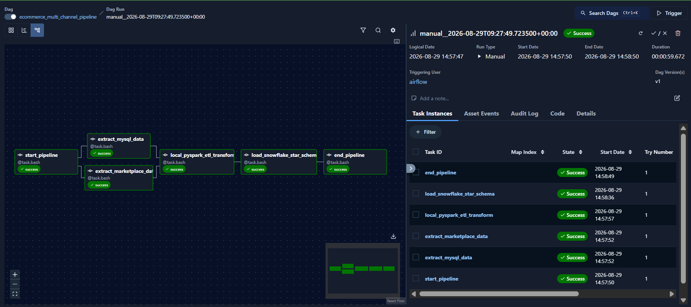
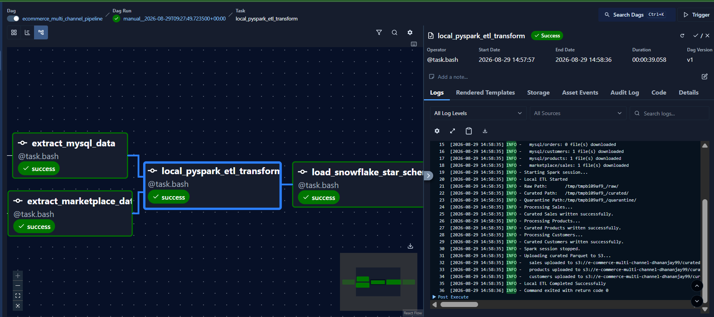
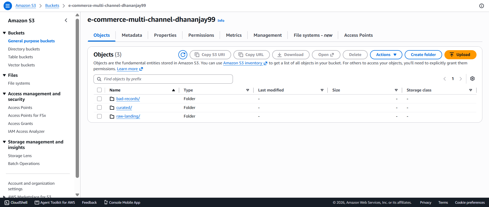
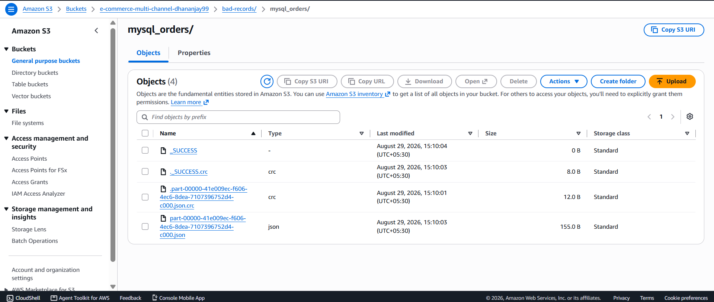
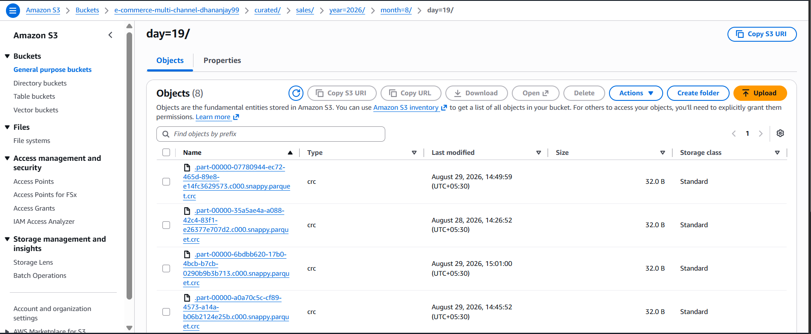
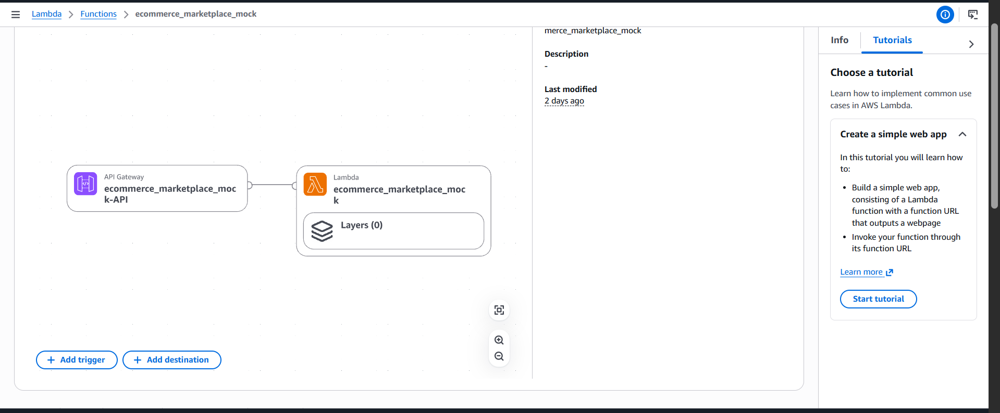
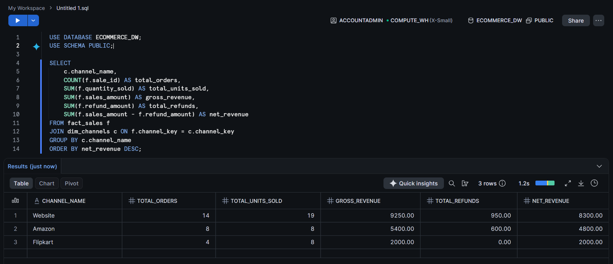

# E-Commerce Multi-Channel Revenue & Inventory Intelligence System

An end-to-end Data Engineering pipeline designed to extract, transform, and analyze multi-channel e-commerce revenue and inventory data. The system ingests transactions from internal operational databases (MySQL) and external marketplaces (Amazon & Flipkart via REST API), processes and cleanses datasets using **PySpark** running locally in containerized environments, stores curated analytical datasets in **Amazon S3**, and models them into a Star Schema data warehouse in **Snowflake**, all orchestrated by **Apache Airflow**.

---

## 1. Pipeline Architecture & Data Flow


```text
┌────────────────────────┐      ┌────────────────────────┐
│  MySQL Database        │      │  Marketplace REST API  │
│  (Operational Orders,  │      │  (AWS Lambda &         │
│   Customers, Products) │      │   API Gateway)         │
└───────────┬────────────┘      └───────────┬────────────┘
            │                               │
            ▼                               ▼
    [ mysql_ingest.py ]           [ marketplace_ingest.py ]
            │                               │
            └───────────────┬───────────────┘
                            ▼
               ┌─────────────────────────┐
               │     Amazon S3 Bucket    │
               │   raw-landing/ (CSV/JSON│
               └────────────┬────────────┘
                            │
                            ▼
               ┌─────────────────────────┐
               │    Local PySpark ETL    │
               │ (Distributed Transform, │
               │  Validation, Quarantine)│
               └───────┬───────────┬─────┘
                       │           │
           Valid data  │           │ Invalid records
                       ▼           ▼
        ┌──────────────────┐  ┌──────────────────┐
        │ Amazon S3 Curated│  │ S3 Quarantine    │
        │ (Parquet format) │  │ bad-records/     │
        └──────────────┬───┘  └──────────────────┘
                       │
                       ▼
            [ load_snowflake.py ]
                       │
                       ▼
        ┌───────────────────────────────┐
        │      Snowflake Warehouse      │
        │ (Star Schema: Fact & Dims)    │
        └───────────────────────────────┘
                       ▲
                       │
        ┌───────────────────────────────┐
        │        Apache Airflow         │
        │   (TaskFlow Orchestration)    │
        └───────────────────────────────┘
```

---

## 2. Core Technical Highlights

### A. Local PySpark Distributed Processing
* **Engine**: Apache Spark (`pyspark`) running locally inside the pipeline infrastructure with dedicated Java (OpenJDK 17) runtime.
* **Resilient S3 I/O**: Interacts with Amazon S3 via `boto3` to pull raw batches, executes distributed Spark DataFrame transformations locally in memory, and writes partitioned columnar **Parquet** datasets back to the S3 curated layer.
* **Unified Transformations**:
  * Unifies disparate schemas across multiple sales channels (`Website`, `Amazon`, `Flipkart`).
  * Normalizes timestamps, handles schema inference, type casting, and null coalescing.
  * Employs multi-column deduplication across order identifiers.
* **Cloud Portability**: The local PySpark transformation logic mirrors enterprise AWS Glue / Amazon EMR jobs line-for-line, enabling zero-code-change cloud deployment if needed.

### B. Automated Quarantine & Data Quality
* Records failing data validation checks are automatically segregated into the quarantine directory (`bad-records/`):
  * Missing foreign keys (`customer_id`, `product_id`)
  * Non-positive sales quantities (`quantity <= 0`)
  * Malformed payloads or null identifiers
* Prevents data corruption downstream in the warehouse while preserving bad records for debugging.

### C. Dimensional Warehouse Modeling (Snowflake)
* **Fact Table (`fact_sales`)**: Stores granular sales transactions, units sold, gross revenue, refund amounts, and foreign keys referencing dimensions.
* **Dimension Tables**:
  * `dim_products`: SCD Type 1 product catalog tracking categories and unit prices across source systems.
  * `dim_customers`: Customer profiles and contact details.
  * `dim_channels`: Sales channel breakdown (`Website`, `Amazon`, `Flipkart`).
* **Idempotent Loading**: Staging tables deduplicated using `QUALIFY ROW_NUMBER()` and merged with `MERGE INTO` statements to ensure zero duplication during backfills.

### D. End-to-End Orchestration (Apache Airflow)
* Modern **Airflow TaskFlow API** (`@dag`, `@task.bash`) pipeline orchestrating each stage linearly with dependency checks:
  1. `start_pipeline`
  2. `extract_mysql_data` & `extract_marketplace_data` (Parallel execution)
  3. `local_pyspark_etl_transform` (PySpark distributed processing)
  4. `load_snowflake_star_schema` (Warehouse loading & merge)
  5. `end_pipeline`

---

## 3. Project Structure

```text
├── airflow/
│   ├── dags/
│   │   └── ecommerce_pipeline_dag.py     # Airflow DAG (TaskFlow API)
│   └── logs/                             # Airflow task execution logs
├── scripts/
│   ├── local_pyspark_transform.py        # PySpark distributed ETL script
│   ├── load_snowflake.py                 # Snowflake dimensional warehouse loader
│   ├── apply_snowflake_schema.py         # Snowflake DDL automation script
│   └── create_s3_buckets.py              # AWS S3 bucket provisioning
├── src/
│   ├── database/
│   │   ├── mysql_schema.sql              # MySQL operational database DDL
│   │   ├── mysql_seed.sql                # Initial transactional seed data
│   │   └── snowflake_schema.sql          # Snowflake dimensional star schema DDL
│   ├── glue/
│   │   └── ecommerce_glue_transform.py   # Cloud Glue/EMR script counterpart
│   └── ingestion/
│       ├── mysql_ingest.py               # Operational DB incremental extractor
│       └── marketplace_ingest.py         # Marketplace REST API extractor (NDJSON)
├── Dockerfile                            # Custom Airflow image with Java 17 & PySpark
├── docker-compose.yml                    # Airflow, Redis, PostgreSQL, MySQL services
├── screenshots/                          # Pipeline execution & verification screenshots
├── .env.example                          # Environment template
└── pyproject.toml                        # Python dependencies
```

---

## 4. Setup & Execution Guide

### Prerequisites
* Docker & Docker Compose
* Python 3.11+ (or `uv`)
* AWS Account (S3 access)
* Snowflake Account

### Step 1: Clone Repository & Configure Environment
```bash
cp .env.example .env
```
Fill in your credentials in `.env`:
* **AWS**: `AWS_ACCESS_KEY_ID`, `AWS_SECRET_ACCESS_KEY`, `AWS_DEFAULT_REGION`, `S3_BUCKET`
* **Snowflake**: `SNOWFLAKE_USER`, `SNOWFLAKE_PASSWORD`, `SNOWFLAKE_ACCOUNT`, etc.
* **MySQL**: `MYSQL_HOST=localhost`, `MYSQL_PORT=3307`, `MYSQL_USER=ecommerce_user`, etc.

### Step 2: Build & Start Containerized Services
Build the custom Airflow image (pre-configured with OpenJDK 17 and PySpark) and launch the stack:
```bash
docker compose build
docker compose up -d
```

Verify all containers are healthy:
```bash
docker compose ps
```

### Step 3: Initialize Database & Cloud Resources
1. **Seed Operational MySQL Database**:
   ```bash
   # Windows PowerShell
   Get-Content src/database/mysql_schema.sql | docker exec -i ecommerce-mysql-source mysql -uecommerce_user -pecommerce_password
   Get-Content src/database/mysql_seed.sql | docker exec -i ecommerce-mysql-source mysql -uecommerce_user -pecommerce_password
   ```

2. **Provision AWS S3 Bucket & Partitions**:
   ```bash
   uv run scripts/create_s3_buckets.py
   ```

3. **Deploy Snowflake Star Schema**:
   ```bash
   uv run scripts/apply_snowflake_schema.py
   ```

---

## 5. Running the Pipeline

### Option A: Via Apache Airflow (Recommended)
1. Open the Airflow Web UI at `http://localhost:8080` (Credentials: `admin` / `admin`).
2. Locate the DAG: **`ecommerce_multi_channel_pipeline`**.
3. Trigger the DAG with a specific logical date (e.g., `2026-08-19`) or run on schedule.
4. Monitor live task logs in Graph and Grid views.

### Option B: Standalone CLI Execution
You can also execute each stage directly for development and testing:
```bash
# 1. Ingest Raw Data to S3
uv run src/ingestion/mysql_ingest.py --date 2026-08-19
uv run src/ingestion/marketplace_ingest.py --date 2026-08-19

# 2. Run Local PySpark ETL (Data Cleansing & S3 Parquet Output)
uv run scripts/local_pyspark_transform.py --date 2026-08-19

# 3. Load Curated Datasets into Snowflake Star Schema
uv run scripts/load_snowflake.py --date 2026-08-19
```

---

## 6. Snowflake Star Schema Specification

### Fact Table: `fact_sales`
| Column | Data Type | Key Type | Description |
|:---|:---|:---|:---|
| `sale_id` | VARCHAR(100) | PK | Unique unified transaction ID |
| `product_key` | INT | FK | References `dim_products.product_key` |
| `customer_key` | INT | FK | References `dim_customers.customer_key` |
| `channel_key` | INT | FK | References `dim_channels.channel_key` |
| `quantity_sold` | INT | Metric | Number of items purchased |
| `sales_amount` | DECIMAL(10,2) | Metric | Total transaction amount |
| `refund_amount` | DECIMAL(10,2) | Metric | Amount refunded (if applicable) |
| `transaction_date` | TIMESTAMP | Dimension | Event timestamp |

### Dimension Tables
* **`dim_products`**: `product_key` (Surrogate PK), `product_id` (Natural ID), `product_name`, `category`, `price`, `source_system`.
* **`dim_customers`**: `customer_key` (Surrogate PK), `customer_id` (Natural ID), `first_name`, `last_name`, `email`, `phone`, `source_system`.
* **`dim_channels`**: `channel_key` (Surrogate PK), `channel_name` (`Website`, `Amazon`, `Flipkart`), `channel_type`.

---

## 7. Business Intelligence & Analytics Queries

With the data modeled into Snowflake, analytics queries can be executed directly:

```sql
-- Multi-Channel Revenue Comparison
SELECT 
    c.channel_name,
    COUNT(f.sale_id) AS total_orders,
    SUM(f.quantity_sold) AS total_units_sold,
    SUM(f.sales_amount) AS gross_revenue,
    SUM(f.refund_amount) AS total_refunds,
    SUM(f.sales_amount - f.refund_amount) AS net_revenue
FROM fact_sales f
JOIN dim_channels c ON f.channel_key = c.channel_key
GROUP BY c.channel_name
ORDER BY net_revenue DESC;
```

---

## 8. Pipeline Execution & Verification Gallery

### A. Apache Airflow End-to-End Orchestration (All Tasks Succeeded)


### B. Local PySpark ETL Task Execution Log inside Airflow


### C. Amazon S3 Data Lake Zones (`bad-records/`, `curated/`, `raw-landing/`)


### D. Automated Quarantine Zone (`bad-records/` JSON Audit Trail)


### E. Amazon S3 Hive-Style Parquet Partitioning (`curated/sales/`)


### F. Serverless Source Integration (AWS Lambda + Amazon API Gateway)


### G. Snowflake Star Schema & Multi-Channel Revenue Analytics


